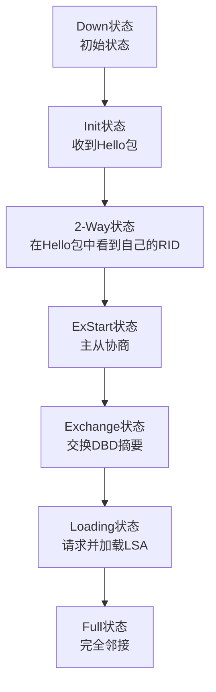

整个建立过程可以划分为以下几个关键状态，其流程如下图所示：

现在，我们来详细解释每一个状态：

1.  **Down (失效状态)**
    *   **描述**: 这是邻接关系的初始状态。表示没有从邻居收到任何信息（Hello包）。
    *   **动作**: 本地路由器会周期性地向外发送Hello包，尝试发现邻居。
2.  **Init (初始状态)**
    *   **描述**: 本地路由器**收到了对端发来的Hello包**，但Hello包中**没有包含自己的Router ID (RID)**。这意味着对方还没有收到我的Hello包，或者我的参数不符合它的要求。
    *   **动作**: 继续交互Hello包。
3.  **2-Way (双向通信状态)**
    *   **描述**: 这是**建立邻接关系的关键前提**。本地路由器在收到的Hello包中，看到了**自己的Router ID**。这表明双向通信已经建立。
    *   **决策点**:
        *   在**广播多路访问网络（如以太网）** 中，DR（指定路由器）和BDR（备份指定路由器）将在此状态后与其他路由器继续建立邻接（FULL），而非DR/BDR路由器之间会停留在此状态。
        *   在**点对点网络**中，所有邻居都会继续向下一个状态发展。
4.  **ExStart (预启动状态)**
    *   **描述**: 这是**邻接关系（而不仅仅是邻居关系）的真正开始**。双方使用**空的DBD（数据库描述）包**来**协商主从关系**。
    *   **目的**: 确定在接下来的数据交换过程中，由谁作为“主”设备来控制交换过程。RID更大的一方将成为主设备。
5.  **Exchange (交换状态)**
    *   **描述**: 主从关系协商完毕后，双方进入此状态。开始互相发送**包含LSDB（链路状态数据库）摘要信息的DBD包**。
    *   **目的**: 通过交换“目录”，互相了解对方有哪些LSA（链路状态通告）是自己没有的。
6.  **Loading (加载状态)**
    *   **描述**: 在收到对端的DBD后，本地路由器会将自身的LSDB与收到的摘要进行对比。
    *   **动作**:
        *   如果发现自己缺少某条LSA，就会向对方发送**LSR（链路状态请求）**。
        *   对方会回复**LSU（链路状态更新）** 来传递完整的LSA信息。
        *   本地路由器收到LSU后，会发送**LSAck（链路状态确认）** 进行确认。
    *   图中的 `LSR`, `LSU`, `LSAck` 报文就是在此状态交互的。
7.  **Full (完全邻接状态)**
    *   **描述**: 这是邻接关系建立的**最终稳定状态**。此时，双方路由器的**LSDB已经完全同步**。
    *   **意义**: 达到此状态后，路由器才能基于完全同步的LSDB，使用SPF算法独立计算出一致且无环的路由表。

---

### 示意图中报文类型说明

*   **Hello**: 用于发现和维持邻居关系。
*   **DD (Database Description Packet)**: 用于描述自己的LSDB摘要，在ExStart和Exchange状态交换。
*   **LSR (Link State Request Packet)**: 用于请求完整的LSA。
*   **LSU (Link State Update Packet)**: 用于发送完整的LSA。
*   **LSAck (Link State Acknowledgment Packet)**: 用于确认收到LSU。

### 总结

OSPF邻接关系的建立是一个严谨的“状态机”过程，从Down到Full，每一步都有特定的任务和报文交互。你的示意图完美地展示了这个完整的生命周期。
